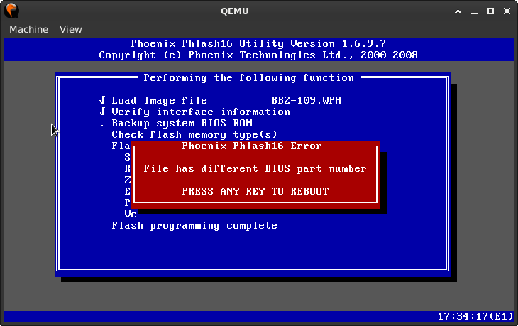
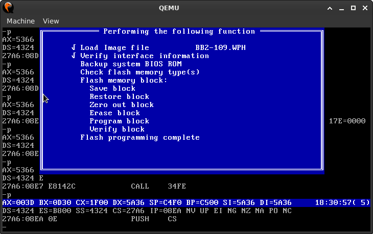
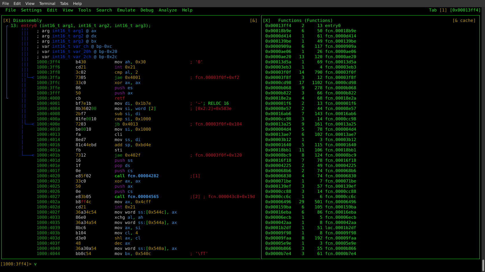

# Acer 8730g

Examining the flash ROM write protection scheme implemented on the Acer 8730g laptop.

## Preface
Having suffered a hardware failure on one of my laptops, I dug out a spare which had been collecting dust for some years. This machine had actually been donated to me, but instead of finding it a good home as usual I've hung on to it as it has a decent keyboard/screen/memory configuration and the CPU is okay for the period (note: the disk in it is terrible however even for the period, a slow 5k, but there are 2 SATA ports so a spare SSD has helped).

One installation of Debian later and a little configuration, the majority of the hardware is working. The advantage of such an old machine is that nearly all the hardware will have had drivers developed by now! :grin: One problem however is that having received this machine so late in it's life it hadn't had any firmware updates. A major pain when using x86 machines (Intel/AMD) is their dependence on the Management Engine (ME, or it's AMD equivalent), it along with other technologies (eg: Intel AMT) provide a fertile ground for those wishing to compromise machines. Once you hit the OEM EOL for a system you are stuck between a rock and hard place in regard to firmware issues. You can have a perfectly functional machine which is a potential security risk due to ageing firmware, and due to the locked down nature of the ME/bootstrap process, left without means to even replace it. There does exist however a few programs which can help in this situation by disabling different aspects of ME (for earlier versions at least), and there are various ways of improving the security of the main firmware (BIOS/(U)EFI) by replacing (aspects) of it with OSS replacements[1][2][3].

Having previously modified a BayTrail tablet's ROM to lobotomise ME, I wanted to experiment with changing the firmware on this machine. In that case modifing the ROM was easy as it was on a daughterboard that could be detached from the mainboard and hooked up to a SPI programmer to read & write the contents. In this case the ROM is on the mainboard which makes programming in system more difficult (plus the machine's a pain to disassemble as well), so programming in situ via software is preferable (obviously still need to factor in the case of having to unbrick it manually :wink: ).

The starting point for this is previously released firmware versions, and visiting Acer's website I was disappointed to find that there were no firmware images available for download. Windows 7 drivers yes, firmware no, thanks a bunch Acer. This left the distasteful option of third party sites, where you have absolutely no assurance of the integrity of the file you're trying to download. I managed to find version 1.09 (same as the system), but with no assurance of what it actually was there was no way it was going anywhere near the system. With this in mind and a wish to be able to update the flash ROM from Linux it's time to roll up the sleeves and peek (or poke, sorry BASIC joke) under the hood.

## Setup
The firmware update comes packaged as a zipfile, so after unpacking it a number of different files are apparent. The update contains software to flash the ROM in both DOS & Windows, and a couple of different ROM images which differ in that one has an additional data section appended to it. Having a DOS executable (**phlash16.exe**) to analyse was handy as the amount of code dedicated to the interface is minimised (generally) so this was selected as the point of attack. 

#### QEMU/FreeDOS

Static analyse can provide insights into the code, but running a binary can provide greater information far faster, so I decided to use QEMU to provide a virtual environment running FreeDOS[4]. With FreeDOS installed and the binary/ROM transfered a test run could be done. The phlash16 program provides a number of different <a href="phlash16-1.6.9.7.exe/phlash16-args.txt">arguments</a> which can be passed to it, and the required parameters can be found in the batch file 'BIOS.BAT'. These are 'phlash16 /x /s /c /mode=3 <bios image>'. Running this produces some output which is not exactly useful but is a good start.
<br clear="right"/><br/>

Originally I had been intending to use gdb as the debugger to interrogate phlash16, as QEMU/gdb are designed to work together. Unfortunately they are designed to work together when QEMU is operating in 32bit mode, not in real mode, this causes the disassembler to incorrectly interprete instructions which is no use. Switching gdb to 16bit mode causes a protocol error with QEMU, and while some people do appear to have worked around the problem, I had no luck. Scratching my head for a little while I remembered 'debug' which is a command line debugger that has been included in MS-DOS since version 1.00. An extended version is included in FreeDOS, so loading up the phlash16 executable with this provides a simple TUI to examine the program.
<br clear="left"/>

#### Radare2

So examining the executable with debug is useful and informative, but to get a better understanding of a program my preferred IDA is radare2. It's has it's flaws but it's OSS, which I much prefer to use where possible. It's built on ncurses so is a TUI rather than a GUI (though there is the 'iaito' Qt frontend), with my main complaint of it being that learning the controls is a bit esoteric. On this particular project there is also another problem however in that the address handling is a little borked. Addresses are displayed as realmode 'segment:offset', but any commands use the actual physical address. Worse still, it also has problems handling the call/jmp instructions (as opposed to lcall/ljmp), where it calculates the address to be always in the first segment, and tracing through the code becomes confusing if you don't notice where you've jumped to. :wink: Last is project management where radare2 saves it's state to a git repo. which in theory sounds like a good idea, however as this state is monolithic it becomes quite hard to check changes that have been made (especially if you mistype addresses!). You can however load in configuration from plain text files which is what I have done here.

<br clear="right"/><br/>

## Phlash16
Initial analysis (aaaa) in radare identifies a number of functions with only the entry point and main function being labeled (which is not surprising). A good place to start when trying to understand a program is the user I/O and this is where things started to become interesting. 

#### Obfuscation (Part 1)
As this is a DOS program it would be expected that the program would use INT 10h to print information to the screen. Searching the program code for '0xcd 0x10' (INT 10h instruction) doesn't produce many results, so the 'debug' commands step over ('p') and step into ('t') were used to identify a section of code that updated the screen. After a few attempts a block was identified that among other things cleared the screen (listing from radare below):

<div style="height: 400px; overflow: auto;"><table height="400px" border=0><tr><td>
<code>
┌ 427: fcn.0000a6d6 ();
│           ; var int16_t var_eh @ bp-0xe
│           ; var uint32_t var_19h @ bp-0x19
│           ; var uint32_t var_1ah @ bp-0x1a
│           ; var uint32_t var_1ch @ bp-0x1c
│           0000:a6d6      c81e0000       enter 0x1e, 0
│           0000:a6da      33db           xor bx, bx
│           0000:a6dc      8ec3           mov es, bx
│           0000:a6de      6626833e4000.  cmp dword es:[0x40], 0
│           0000:a6e5      7505           jne 0xa6ec
│           0000:a6e7      33c0           xor ax, ax
│           0000:a6e9      c9             leave
│           0000:a6ea      cb             retf
            0000:a6eb      90             nop
│           0000:a6ec      66c746f20012.  mov dword [var_eh], 0x55101200 ; [0x55101200:4]=-1
│           0000:a6f4      8d46e4         lea ax, [var_1ch]
│           0000:a6f7      16             push ss
│           0000:a6f8      50             push ax
│           0000:a6f9      8d4ef2         lea cx, [var_eh]
│           0000:a6fc      16             push ss
│           0000:a6fd      51             push cx
│           0000:a6fe      6a10           push 0x10
│           0000:a700      9a805c1213     lcall fcn.00018da0           ; RELOC 16 
│           0000:a705      83c40a         add sp, 0xa
│           0000:a708      807ee755       cmp byte [var_19h], 0x55     ; 'U'
│           0000:a70c      0f85d400       jne 0xa7e4
│           0000:a710      c746f20300     mov word [var_eh], 3
│           0000:a715      8d46e4         lea ax, [var_1ch]
│           0000:a718      16             push ss
│           0000:a719      50             push ax
│           0000:a71a      8d4ef2         lea cx, [var_eh]
│           0000:a71d      16             push ss
│           0000:a71e      51             push cx
│           0000:a71f      6a10           push 0x10
│           0000:a721      9a805c1213     lcall fcn.00018da0           ; RELOC 16 
│           0000:a726      83c40a         add sp, 0xa
│           0000:a729      c746f2000f     mov word [var_eh], 0xf00     ; [0xf00:2]=0x681e
│           0000:a72e      8d46e4         lea ax, [var_1ch]
│           0000:a731      16             push ss
│           0000:a732      50             push ax
│           0000:a733      8d4ef2         lea cx, [var_eh]
│           0000:a736      16             push ss
│           0000:a737      51             push cx
│           0000:a738      6a10           push 0x10
│           0000:a73a      9a805c1213     lcall fcn.00018da0           ; RELOC 16 
│           0000:a73f      83c40a         add sp, 0xa
│           0000:a742      8a46e4         mov al, byte [var_1ch]
│           0000:a745      2ae4           sub ah, ah
│           0000:a747      48             dec ax
│           0000:a748      48             dec ax
│           0000:a749      7455           je 0xa7a0
│           0000:a74b      48             dec ax
│           0000:a74c      0f848800       je 0xa7d8
│           0000:a750      2d0400         sub ax, 4
│           0000:a753      743a           je 0xa78f
│           0000:a755      c746f20700     mov word [var_eh], 7
│           0000:a75a      8d46e4         lea ax, [var_1ch]
│           0000:a75d      16             push ss
│           0000:a75e      50             push ax
│           0000:a75f      8d4ef2         lea cx, [var_eh]
│           0000:a762      16             push ss
│           0000:a763      51             push cx
│           0000:a764      6a10           push 0x10
│           0000:a766      9a805c1213     lcall fcn.00018da0           ; RELOC 16 
│           0000:a76b      83c40a         add sp, 0xa
│           0000:a76e      c746f2000f     mov word [var_eh], 0xf00     ; [0xf00:2]=0x681e
│           0000:a773      8d46e4         lea ax, [var_1ch]
│           0000:a776      16             push ss
│           0000:a777      50             push ax
│           0000:a778      8d4ef2         lea cx, [var_eh]
│           0000:a77b      16             push ss
│           0000:a77c      51             push cx
│           0000:a77d      6a10           push 0x10
│           0000:a77f      9a805c1213     lcall fcn.00018da0           ; RELOC 16 
│           0000:a784      83c40a         add sp, 0xa
│           0000:a787      807ee407       cmp byte [var_1ch], 7
│           0000:a78b      0f8558ff       jne 0xa6e7
│           0000:a78f      66c7062e3b00.  mov dword [0x3b2e], 0xb0000000 ; [0x3b2e:4]=0x1312089e
│           0000:a798      c7064673b403   mov word [0x7346], 0x3b4     ; [0x7346:2]=0xb49a
│           0000:a79e      eb33           jmp 0xa7d3
│           0000:a7a0      c746f20152     mov word [var_eh], 0x5201    ; [0x5201:2]=0x9a05
│           0000:a7a5      8d46e4         lea ax, [var_1ch]
│           0000:a7a8      16             push ss
│           0000:a7a9      50             push ax
│           0000:a7aa      8d46f2         lea ax, [var_eh]
│           0000:a7ad      16             push ss
│           0000:a7ae      50             push ax
│           0000:a7af      6a10           push 0x10
│           0000:a7b1      9a805c1213     lcall fcn.00018da0           ; RELOC 16 
│           0000:a7b6      83c40a         add sp, 0xa
│           0000:a7b9      837ee600       cmp word [var_1ah], 0
│           0000:a7bd      0f8426ff       je 0xa6e7
│           0000:a7c1      8b46e6         mov ax, word [var_1ah]
│           0000:a7c4      c7062e3b0000   mov word [0x3b2e], 0         ; [0x3b2e:2]=0x89e
│           0000:a7ca      a3303b         mov word [0x3b30], ax        ; [0x3b30:2]=0x1312
│           0000:a7cd      c7064673d403   mov word [0x7346], 0x3d4     ; [0x7346:2]=0xb49a
│           0000:a7d3      b8ffff         mov ax, 0xffff
│           0000:a7d6      c9             leave
│           0000:a7d7      cb             retf
│           0000:a7d8      66c7062e3b00.  mov dword [0x3b2e], 0xb8000000 ; [0x3b2e:4]=0x1312089e
│           0000:a7e1      ebea           jmp 0xa7cd
            0000:a7e3      90             nop
│           0000:a7e4      c746f2001a     mov word [var_eh], 0x1a00    ; [0x1a00:2]=0x1215
│           0000:a7e9      8d46e4         lea ax, [var_1ch]
│           0000:a7ec      16             push ss
│           0000:a7ed      50             push ax
│           0000:a7ee      8d4ef2         lea cx, [var_eh]
│           0000:a7f1      16             push ss
│           0000:a7f2      51             push cx
│           0000:a7f3      6a10           push 0x10
│           0000:a7f5      9a805c1213     lcall fcn.00018da0           ; RELOC 16 
│           0000:a7fa      83c40a         add sp, 0xa
│           0000:a7fd      807ee41a       cmp byte [var_1ch], 0x1a
│           0000:a801      0f85e2fe       jne 0xa6e7
│           0000:a805      f606840108     test byte [0x184], 8         ; [0x184:1]=80
│           0000:a80a      7519           jne 0xa825
│           0000:a80c      c746f20300     mov word [var_eh], 3
│           0000:a811      8d46e4         lea ax, [var_1ch]
│           0000:a814      16             push ss
│           0000:a815      50             push ax
│           0000:a816      8d46f2         lea ax, [var_eh]
│           0000:a819      16             push ss
│           0000:a81a      50             push ax
│           0000:a81b      6a10           push 0x10
│           0000:a81d      9a805c1213     lcall fcn.00018da0           ; RELOC 16 
│           0000:a822      83c40a         add sp, 0xa
│           0000:a825      c746f2000f     mov word [var_eh], 0xf00     ; [0xf00:2]=0x681e
│           0000:a82a      8d46e4         lea ax, [var_1ch]
│           0000:a82d      16             push ss
│           0000:a82e      50             push ax
│           0000:a82f      8d4ef2         lea cx, [var_eh]
│           0000:a832      16             push ss
│           0000:a833      51             push cx
│           0000:a834      6a10           push 0x10
│           0000:a836      9a805c1213     lcall fcn.00018da0           ; RELOC 16 
│           0000:a83b      83c40a         add sp, 0xa
│           0000:a83e      807ee403       cmp byte [var_1ch], 3
│           0000:a842      7512           jne 0xa856
│           0000:a844      66c7062e3b00.  mov dword [0x3b2e], 0xb8000000 ; [0x3b2e:4]=0x1312089e
│           0000:a84d      c7064673d403   mov word [0x7346], 0x3d4     ; [0x7346:2]=0xb49a
│           0000:a853      eb10           jmp 0xa865
            0000:a855      90             nop
│           0000:a856      66c7062e3b00.  mov dword [0x3b2e], 0xb0000000 ; [0x3b2e:4]=0x1312089e
│           0000:a85f      c7064673b403   mov word [0x7346], 0x3b4     ; [0x7346:2]=0xb49a
│           0000:a865      66c746f20310.  mov dword [var_eh], 0x1003   ; [0x1003:4]=0xc4830fb6
│           0000:a86d      8d46e4         lea ax, [var_1ch]
│           0000:a870      16             push ss
│           0000:a871      50             push ax
│           0000:a872      8d46f2         lea ax, [var_eh]
│           0000:a875      16             push ss
│           0000:a876      50             push ax
│           0000:a877      6a10           push 0x10
│           0000:a879      9a805c1213     lcall fcn.00018da0           ; RELOC 16 
│           0000:a87e      83c40a         add sp, 0xa
└           0000:a881      e94fff         jmp 0xa7d3
</code>
</td></tr></table></div>

There's no INT instructions throughout the function, it just calls the same function with different parameters, so lets look at that.

<div style="height: 400px; overflow: auto;"><table height="400px" border=0><tr><td>
<code>
┌ 36: fcn.00018da0 (int16_t arg_6h);
│           ; arg int16_t arg_6h @ bp+0x6
│           ; var int16_t var_8h @ bp-0x8
│           ; var int16_t var_9h @ bp-0x9
│           ; var int16_t var_ah @ bp-0xa
│           1000:8da0      55             push bp
│           1000:8da1      8bec           mov bp, sp
│           1000:8da3      56             push si
│           1000:8da4      57             push di
│           1000:8da5      83ec0a         sub sp, 0xa
│           1000:8da8      c646f6cd       mov byte [var_ah], 0xcd      ; [0xcd:1]=131
│           1000:8dac      8b4606         mov ax, word [arg_6h]
│           1000:8daf      8846f7         mov byte [var_9h], al
│           1000:8db2      3c25           cmp al, 0x25                 ; '%'
│           1000:8db4      740a           je 0x8dc0
│           1000:8db6      3c26           cmp al, 0x26                 ; '&'
│           1000:8db8      7406           je 0x8dc0
│           1000:8dba      c646f8cb       mov byte [var_8h], 0xcb      ; [0xcb:1]=18
│           1000:8dbe      eb0c           jmp fcn.00008dcc
            1000:8dc0      c646facb       mov byte [bp - 6], 0xcb      ; [0xcb:1]=18
            1000:8dc4      c646f944       mov byte [bp - 7], 0x44      ; 'D'
                                                                       ; [0x44:1]=104
            1000:8dc8      c646f844       mov byte [bp - 8], 0x44      ; 'D'
                                                                       ; [0x44:1]=104
            1000:8dcc      8c56f4         mov word [bp - 0xc], ss
            1000:8dcf      8d46f6         lea ax, [bp - 0xa]
            1000:8dd2      8946f2         mov word [bp - 0xe], ax
            1000:8dd5      1e             push ds
            1000:8dd6      c57e08         lds di, [bp + 8]
            1000:8dd9      8b05           mov ax, word [di]
            1000:8ddb      8b5d02         mov bx, word [di + 2]
            1000:8dde      8b4d04         mov cx, word [di + 4]
            1000:8de1      8b5506         mov dx, word [di + 6]
            1000:8de4      8b7508         mov si, word [di + 8]
            1000:8de7      8b7d0a         mov di, word [di + 0xa]
            1000:8dea      1f             pop ds
            1000:8deb      55             push bp
            1000:8dec      f8             clc
            1000:8ded      ff5ef2         lcall [bp - 0xe]
            1000:8df0      5d             pop bp
            1000:8df1      fc             cld
            1000:8df2      1e             push ds
            1000:8df3      57             push di
            1000:8df4      c57e0c         lds di, [bp + 0xc]
            1000:8df7      8905           mov word [di], ax
            1000:8df9      895d02         mov word [di + 2], bx
            1000:8dfc      894d04         mov word [di + 4], cx
            1000:8dff      895506         mov word [di + 6], dx
            1000:8e02      897508         mov word [di + 8], si
            1000:8e05      8f450a         pop word [di + 0xa]
            1000:8e08      7204           jb 0x8e0e                    ; fcn.00008e06+0x8
            1000:8e0a      33f6           xor si, si
            1000:8e0c      eb0f           jmp 0x8e1d                   ; fcn.00008e06+0x17
            1000:8e0e      59             pop cx
            1000:8e0f      51             push cx
            1000:8e10      1e             push ds
            1000:8e11      8ed9           mov ds, cx
            1000:8e13      0e             push cs
            1000:8e14      e8cdb7         call fcn.000045e4            ; fcn.000043c8+0x21c
            1000:8e17      1f             pop ds
            1000:8e18      be0100         mov si, 1
            1000:8e1b      8b05           mov ax, word [di]
            1000:8e1d      89750c         mov word [di + 0xc], si
            1000:8e20      1f             pop ds
            1000:8e21      83c40a         add sp, 0xa
            1000:8e24      5f             pop di
            1000:8e25      5e             pop si
            1000:8e26      8be5           mov sp, bp
            1000:8e28      5d             pop bp
            1000:8e29      cb             retf
</code>
</td></tr></table></div>

Still no sign of an INT 10h, so what's going on? Examining the code further:
```
│           1000:8da8      c646f6cd       mov byte [var_ah], 0xcd      ; [0xcd:1]=131
│           1000:8dac      8b4606         mov ax, word [arg_6h]
│           1000:8daf      8846f7         mov byte [var_9h], al
```
The first thing it does is move 0xcd into a memory address, fetches a value from the stack, and pushes the lower portion of it into the following memory address. I think you can probably guess that at this point AL equals 0x10. A little bit further on it then saves 0xcb (retf) after that. It also creates a jmp address:
```
            1000:8dcc      8c56f4         mov word [bp - 0xc], ss
            1000:8dcf      8d46f6         lea ax, [bp - 0xa]
            1000:8dd2      8946f2         mov word [bp - 0xe], ax
```
Loads any required registers:
```
            1000:8dd9      8b05           mov ax, word [di]
            1000:8ddb      8b5d02         mov bx, word [di + 2]
            1000:8dde      8b4d04         mov cx, word [di + 4]
            1000:8de1      8b5506         mov dx, word [di + 6]
            1000:8de4      8b7508         mov si, word [di + 8]
            1000:8de7      8b7d0a         mov di, word [di + 0xa]
```
Then jumps to the newly created mini-function:
```
            1000:8ded      ff5ef2         lcall [bp - 0xe]
```
So all this is just a way to obfuscate INT calls, so having defined this function it can be seen that the previous one does in fact initialise the screen (among other things). This sets the tone for the analyse of the rest of this binary.

#### I/O Ports
Speaking of tone, in the function that calls initialise screen (which is the 2nd function):
<div style="height: 400px; overflow: auto;"><table height="400px" border=0><tr><td>
<code>
┌ 40: fcn.000019b4 ();
│           0000:19b4      6a56           push 0x56                    ; 'V'
│           0000:19b6      66ff368401     push dword [0x184]
│           0000:19bb      9a98096d0a     lcall fcn.0000b068           ; RELOC 16 
│           0000:19c0      83c406         add sp, 6
│           0000:19c3      9a06006d0a     lcall fcn.0000a6d6           ; RELOC 16 
│           0000:19c8      0bc0           or ax, ax
│           0000:19ca      7405           je 0x19d1
│           0000:19cc      800e8d0102     or byte [0x18d], 2
│           0000:19d1      6a07           push 7
│           0000:19d3      9a6c0b6d0a     lcall fcn.0000b23c           ; RELOC 16 
│           0000:19d8      83c402         add sp, 2
└           0000:19db      cb             retf
</code>
</td></tr></table></div>

The first one is worth analysing as well:
<div style="height: 400px; overflow: auto;"><table height="400px" border=0><tr><td>
<code>
┌ 278: fcn.0000b068 (int16_t arg_6h, int16_t arg_ah);
│           ; arg int16_t arg_6h @ bp+0x6
│           ; arg int16_t arg_ah @ bp+0xa
│           ; var uint32_t var_2h @ bp-0x2
│           ; var int16_t var_4h @ bp-0x4
│           ; var int16_t var_6h @ bp-0x6
│           0000:b068      c8060000       enter 6, 0
│           0000:b06c      ff760a         push word [arg_ah]
│           0000:b06f      688000         push 0x80
│           0000:b072      9ab45d1213     lcall fcn.00018ed4           ; RELOC 16 
│           0000:b077      83c404         add sp, 4
│           0000:b07a      f6460608       test byte [arg_6h], 8
│           0000:b07e      0f85fa00       jne 0xb17c
│           0000:b082      ff760a         push word [arg_ah]
│           0000:b085      688000         push 0x80
│           0000:b088      9ab45d1213     lcall fcn.00018ed4           ; RELOC 16 
│           0000:b08d      83c404         add sp, 4
│           0000:b090      666a70         push 0x70                    ; 'p'
│           0000:b093      9ab45d1213     lcall fcn.00018ed4           ; RELOC 16 
│           0000:b098      83c404         add sp, 4
│           0000:b09b      6a71           push 0x71                    ; 'q'
│           0000:b09d      9aa65d1213     lcall fcn.00018ec6           ; RELOC 16 
│           0000:b0a2      83c402         add sp, 2
│           0000:b0a5      8846fe         mov byte [var_2h], al
│           0000:b0a8      666870000200   push 0x20070                 ; 'p'
│           0000:b0ae      9ab45d1213     lcall fcn.00018ed4           ; RELOC 16 
│           0000:b0b3      83c404         add sp, 4
│           0000:b0b6      6a71           push 0x71                    ; 'q'
│           0000:b0b8      9aa65d1213     lcall fcn.00018ec6           ; RELOC 16 
│           0000:b0bd      83c402         add sp, 2
│           0000:b0c0      8846fc         mov byte [var_4h], al
│           0000:b0c3      666870000400   push 0x40070                 ; 'p'
│           0000:b0c9      9ab45d1213     lcall fcn.00018ed4           ; RELOC 16 
│           0000:b0ce      83c404         add sp, 4
│           0000:b0d1      6a71           push 0x71                    ; 'q'
│           0000:b0d3      9aa65d1213     lcall fcn.00018ec6           ; RELOC 16 
│           0000:b0d8      83c402         add sp, 2
│           0000:b0db      8846fa         mov byte [var_6h], al
│           0000:b0de      66a18c01       mov eax, dword [0x18c]       ; [0x18c:4]=0x1312089e
│           0000:b0e2      662500800010   and eax, 0x10008000
│           0000:b0e8      660bc0         or eax, eax
│           0000:b0eb      746f           je 0xb15c
│           0000:b0ed      8a460a         mov al, byte [arg_ah]
│           0000:b0f0      2ae4           sub ah, ah
│           0000:b0f2      50             push ax
│           0000:b0f3      8a46fe         mov al, byte [var_2h]
│           0000:b0f6      250f00         and ax, 0xf
│           0000:b0f9      053000         add ax, 0x30
│           0000:b0fc      50             push ax
│           0000:b0fd      8a46fe         mov al, byte [var_2h]
│           0000:b100      c0e804         shr al, 4
│           0000:b103      2ae4           sub ah, ah
│           0000:b105      053000         add ax, 0x30
│           0000:b108      50             push ax
│           0000:b109      8a46fc         mov al, byte [var_4h]
│           0000:b10c      250f00         and ax, 0xf
│           0000:b10f      053000         add ax, 0x30
│           0000:b112      50             push ax
│           0000:b113      8a46fc         mov al, byte [var_4h]
│           0000:b116      c0e804         shr al, 4
│           0000:b119      2ae4           sub ah, ah
│           0000:b11b      053000         add ax, 0x30
│           0000:b11e      50             push ax
│           0000:b11f      8a46fa         mov al, byte [var_6h]
│           0000:b122      250f00         and ax, 0xf
│           0000:b125      053000         add ax, 0x30
│           0000:b128      50             push ax
│           0000:b129      8a46fa         mov al, byte [var_6h]
│           0000:b12c      c0e804         shr al, 4
│           0000:b12f      2ae4           sub ah, ah
│           0000:b131      053000         add ax, 0x30                 ; int16_t arg_6h
│           0000:b134      50             push ax
│           0000:b135      1e             push ds
│           0000:b136      68893c         push 0x3c89
│           0000:b139      1e             push ds
│           0000:b13a      68d25c         push 0x5cd2
│           0000:b13d      9a96391213     lcall fcn.00016ab6           ; RELOC 16 
│           0000:b142      83c416         add sp, 0x16
│           0000:b145      1e             push ds
│           0000:b146      68d25c         push 0x5cd2
│           0000:b149      66681f001000   push 0x10001f                ; '\x1f'
│           0000:b14f      666844001800   push 0x180044                ; 'D'
│           0000:b155      0e             push cs
│           0000:b156      e8c7fc         call fcn.0000ae20
│           0000:b159      83c40c         add sp, 0xc
│           0000:b15c      a0642c         mov al, byte [0x2c64]        ; [0x2c64:1]=199
│           0000:b15f      3846fe         cmp byte [var_2h], al
│           0000:b162      7418           je 0xb17c
│           0000:b164      f6460610       test byte [arg_6h], 0x10
│           0000:b168      750c           jne 0xb176
│           0000:b16a      3cff           cmp al, 0xff
│           0000:b16c      7408           je 0xb176
│           0000:b16e      1e             push ds
│           0000:b16f      68a23b         push 0x3ba2
│           0000:b172      0e             push cs
│           0000:b173      e8d603         call fcn.0000b54c
│           0000:b176      8a46fe         mov al, byte [var_2h]
│           0000:b179      a2642c         mov byte [0x2c64], al        ; [0x2c64:1]=199
│           0000:b17c      c9             leave
└           0000:b17d      cb             retf
</code>
</td></tr></table></div>

The first two different function calls are obviously for:
```
┌ 14: fcn.00018ed4 (int16_t arg_6h, int16_t arg_8h);
│           1000:8ed4      55             push bp
│           1000:8ed5      8bec           mov bp, sp
│           1000:8ed7      8b5606         mov dx, word [arg_6h]
│           1000:8eda      8a4608         mov al, byte [arg_8h]
│           1000:8edd      ee             out dx, al
│           1000:8ede      b400           mov ah, 0
│           1000:8ee0      5d             pop bp
└           1000:8ee1      cb             retf
```
Writing to an I/O port.
```
┌ 13: fcn.00018ec6 (int16_t arg_6h);
│           1000:8ec6      55             push bp
│           1000:8ec7      8bec           mov bp, sp
│           1000:8ec9      8b5606         mov dx, word [arg_6h]
│           1000:8ecc      ec             in al, dx
│           1000:8ecd      32e4           xor ah, ah
│           1000:8ecf      8be5           mov sp, bp
│           1000:8ed1      5d             pop bp
└           1000:8ed2      cb             retf
```
Reading from an I/O port.

Applying this knowlege to the previous function it can be seen that it's interogating I/O ports 0x70-71 which is the RTC, and is infact reading the time (defining this function is helpful because it's call'ed from all over the code). Note that I/O port 0x80 is the BIOS debug port, and if implemented is just a register connected to a hexadecimal LED/LCD display and normally shows POST codes from the firmware at startup.

Also called from this function is this:
<div style="height: 400px; overflow: auto;"><table height="400px" border=0><tr><td>
<code>
┌ 7: fcn.0000b54c (int16_t arg3);
│           ; arg int16_t arg3 @ bx
│           0000:b54c      c8020000       enter 2, 0
└           0000:b550      e98900         jmp 0xb5dc
            0000:b553      90             nop
            0000:b554      66684300b600   push 0xb60043                ; 'C'
            0000:b55a      9ab45d1213     lcall fcn.00018ed4           ; RELOC 16 
            0000:b55f      83c404         add sp, 4
            0000:b562      c45e06         les bx, [bp + 6]
            0000:b565      2ae4           sub ah, ah
            0000:b567      268a07         mov al, byte es:[bx]
            0000:b56a      50             push ax
            0000:b56b      6a42           push 0x42                    ; 'B'
            0000:b56d      9ab45d1213     lcall fcn.00018ed4           ; RELOC 16 
            0000:b572      83c404         add sp, 4
            0000:b575      c45e06         les bx, [bp + 6]
            0000:b578      2ae4           sub ah, ah
            0000:b57a      268a4701       mov al, byte es:[bx + 1]
            0000:b57e      50             push ax
            0000:b57f      6a42           push 0x42                    ; 'B'
            0000:b581      9ab45d1213     lcall fcn.00018ed4           ; RELOC 16 
            0000:b586      83c404         add sp, 4
            0000:b589      c45e06         les bx, [bp + 6]
            0000:b58c      26833f00       cmp word es:[bx], 0
            0000:b590      7417           je 0xb5a9
            0000:b592      6a61           push 0x61                    ; 'a'
            0000:b594      9aa65d1213     lcall fcn.00018ec6           ; RELOC 16 
            0000:b599      83c402         add sp, 2
            0000:b59c      0c03           or al, 3
            0000:b59e      50             push ax
            0000:b59f      6a61           push 0x61                    ; 'a'
            0000:b5a1      9ab45d1213     lcall fcn.00018ed4           ; RELOC 16 
            0000:b5a6      83c404         add sp, 4
            0000:b5a9      c45e06         les bx, [bp + 6]
            0000:b5ac      26ff7702       push word es:[bx + 2]
            0000:b5b0      0e             push cs
            0000:b5b1      e83600         call fcn.0000b5ea
            0000:b5b4      83c402         add sp, 2
            0000:b5b7      c45e06         les bx, [bp + 6]
            0000:b5ba      26833f00       cmp word es:[bx], 0
            0000:b5be      7418           je 0xb5d8
            0000:b5c0      6a61           push 0x61                    ; 'a'
            0000:b5c2      9aa65d1213     lcall fcn.00018ec6           ; RELOC 16 
            0000:b5c7      83c402         add sp, 2
            0000:b5ca      25fc00         and ax, 0xfc
            0000:b5cd      50             push ax
            0000:b5ce      6a61           push 0x61                    ; 'a'
            0000:b5d0      9ab45d1213     lcall fcn.00018ed4           ; RELOC 16 
            0000:b5d5      83c404         add sp, 4
            0000:b5d8      83460604       add word [bp + 6], 4
            0000:b5dc      c45e06         les bx, [bp + 6]
            0000:b5df      26837f0200     cmp word es:[bx + 2], 0
            0000:b5e4      0f856cff       jne 0xb554
            0000:b5e8      c9             leave
            0000:b5e9      cb             retf
</code>
</td></tr></table></div>
It's not particularly important, and even potentially annoying. It's writing to I/O ports 0x42-43 which is the PIT (Programmable Interval Timer), and port 0x61 which is the KBC (KeyBoard Controller). What do these things have in common? The PC speaker. The PIT generates a square wave, and there's a gate in the KBC which enables the PIT to drive the PC speaker. The 'call fcn.0000b5ea' is a jump to a time delay which sets the interval of the beep.

#### QEMU options
This function is not needed (phlash even has a parameter to disable it), but I (briefly) thought it'd be nice to have QEMU output the beep which it does support. Adding the arguements '-audiodev alsa,id=default -machine pcspk-audiodev=default' to QEMU's command line parameters rewards you with the PC speaker on your sound card.

While this option is not particularly needed, even wanted, more helpful options came to light while reading QEMU's manpage. The VGA adapter is, by default, routed to an SDL backed window which provides the system display. There is an option available, '-display curses', which instead renders the VGA display using the (n)curses library. Obviously this is useless for a graphical mode where it'll display nothing, but handy when the system is in text mode as here. Specifically, with the debugger, you can select and copy data from the text display which makes note taking far quicker!

But why stop there, the emulator also supports standard serial ports with various different backends to facilitate the transfer of information. One particular backend is telnet which for those unaware is an early network console access protocol/tool (it's SSH without the encryption). With this option QEMU can run a telnet server which when connected to with a telnet client provides the I/O stream for the emulated serial port. How's this helpful? Well a less utilised function in MS-DOS (or it's equivalent) is redirection. The various redirection operators (ie. >) are available to push information to/from 'files', which can be regular files or devices which includes the serial (COMx) ports. Still not seeing the potential? Well there's also the 'ctty' program, this will redirect the console to the given interface (which can include things like LPTx, a parallel port, so be careful). So entering 'ctty COM1' in the VGA display will redirect the DOS prompt to the 1st serial port! The advantage of this is that it seperates out the 2 displays (program/debugger), as the program drives the VGA display pretty directly, while the debugger is hanging off the standard I/O. This also means though that you get a history of what the debugger has executed (if you've stepped through it) for as long as the text buffer of the terminal.

QEMU options used:

```
qemu-system-x86_64 -audiodev alsa,id=default -machine pcspk-audiodev=default \
	-chardev socket,id=telmon,host=localhost,port=4443,ipv4,server,nowait,telnet -mon chardev=telmon,mode=readline \
	-serial telnet:localhost:4444,server,nowait \
	<path_2_drive.img>
```

Which runs a system with PC speaker support, QEMU's monitor provided by a telnet server on port 4443, and the emulated system's serial port (COM1) on a telnet server on port 4444. 

#### Obfuscation (Part 2)
Analysis of the binary continued, picking off functions where it's purpose could be easily identified or was deemed particularly important. One bit off obfuscation that came up continually was this:
<div style="height: 400px; overflow: auto;"><table height="400px" border=0><tr><td>
<code>
│           0000:37cb      b87e1d         mov ax, 0x1d7e               ; '~\x1d' ;
│           0000:37ce      8cda           mov dx, ds                   ;
│           0000:37d0      80e40f         and ah, 0xf
│           0000:37d3      03c0           add ax, ax
│           0000:37d5      13d2           adc dx, dx
│           0000:37d7      13c0           adc ax, ax
│           0000:37d9      13d2           adc dx, dx
│           0000:37db      13c0           adc ax, ax                   ; "j"
│           0000:37dd      13d2           adc dx, dx
│           0000:37df      13c0           adc ax, ax
│           0000:37e1      13d2           adc dx, dx
│           0000:37e3      13c0           adc ax, ax
│           0000:37e5      92             xchg ax, dx
│           0000:37e6      83e20f         and dx, 0xf
│           0000:37e9      05871d         add ax, 0x1d87
│           0000:37ec      83d200         adc dx, 0
│           0000:37ef      52             push dx
│           0000:37f0      50             push ax
</code>
</td></tr></table></div>
This basically pushes the address 4000:4FEA onto the stack, and this turns out to be the pointer to the string 'MMIOBASE'. Considering how frequently this appears (with different presets), I do wonder how much of phlash16's 143 kB is actually obfuscation!

####ZFLPF table
Working my way through the code it became apparent that the '/mode=' argument selects different programming interfaces for phlash to use. In mode 3 it searches for the string 'ZFLPF' in the section of data appended to the main ROM image (that is in the .WPH file, not the plain .ROM file). In searching for additional information I came across one PDF[5] which references it, but no more. The PDF mentions that the access code is included in the ROM image but little more. Extracting the extra data from the WPH file it appears to contain some text configuration data:

```
;===================================================================================
; Wistron WinFlash64 2.x Configuration File
;===================================================================================
U!ID
ROM_TYPE=1$SUPT_NUM=4$ROMADR=FFE00000$CMDADR=FF800000$BLOCK=0040$SECTOR=0004$SKIPADR=00000000$SKIPSIZE=0000$
U!01
ROM_ID=EF14$DEV_NAME=W25x16$CMD_ID=1$C0$ADR=1$03$CMD_ER=1$80$ADR=1$03$CMD_PR=2$A0B8$ADR=1$03$FLASH_MODE=5$1055AACDBE$ADR=1$03$EXIT_MODE=1$22$ADR=1$03$
U!02
ROM_ID=C214$DEV_NAME=MX25L1605A$CMD_ID=1$C0$ADR=1$03$CMD_ER=1$80$ADR=1$03$CMD_PR=2$A0B8$ADR=1$03$FLASH_MODE=5$1055AACDBE$ADR=1$03$EXIT_MODE=1$22$ADR=1$03$
U!03
ROM_ID=BF41$DEV_NAME=SST25VF016B$CMD_ID=1$C0$ADR=1$03$CMD_ER=1$80$ADR=1$03$CMD_PR=2$A0B8$ADR=1$03$FLASH_MODE=5$1055AACDBE$ADR=1$03$EXIT_MODE=1$22$ADR=1$03$
U!04
ROM_ID=1C14$DEV_NAME=EN25F16$CMD_ID=1$C0$ADR=1$03$CMD_ER=1$80$ADR=1$03$CMD_PR=2$A0B8$ADR=1$03$FLASH_MODE=5$1055AACDBE$ADR=1$03$EXIT_MODE=1$22$ADR=1$03$

```

Which is not immediately helpful (but more on this later), and examining the remaining 6kB reveals a mixture of code and data. The 'ZFLPF' identifier is followed by values which look very well like pointers:

```
  2009FF     5a 46 4c 50 46 00 00 00  00 00 00 00 00 00 00 00  00 4a 03 00 00 46 04 00      ZFLPF............J...F..
  200A17     00 00 00 00 00 00 00 00  00 d8 04 00 00 00 00 00  00 00 00 00 00 00 00 00      ........................
```

Disassembling the data at addresses 0x034a, 0x0446 & 0x04d8 (using the 'ZFLPF' identifier as the base address) reveals a number of functions, with the entry point correctly identified (so the interpretation of the table probably correct). Using phlash's '/ro=' argument to try to dump the ROM contents, and watching for accesses to those functions, it can be confirmed that the functions correspond to (my naming convention):

```
	0x034A -> Grant flash access
	0x0446 -> Revoke flash access
	0x04D8 -> System reset
```

So what's this code actually doing? To make any sense of it Intel's documentation of the ICH[6] (I/O Controller Hub) was need.

####Grant flash access
This function does the most both in it's code block, and sub-functions. Note: 
1. This, and any subsequent listings are dissambled from a dump starting at the 0x034A offset.
2. Left in my comments/labels which should be broadly correct, but if anything is mislabeled mea culpa.
<div style="height: 400px; overflow: auto;"><table height="400px" border=0><tr><td>
<code>
┌ 1: fcn.romEntryHook[00000000] ();
└           0000:0000     9c             pushf
            0000:0001     6660           pushal
            0000:0003     ba0204         mov dx, 0x402                 ; ACPI: PM1_EN - Power Management 1 Enable
            0000:0006     ed             in ax, dx
            0000:0007     25fffe         and ax, 0xfeff                ; Disable Power Button Enable (PWRBTN_EN)
            0000:000a     ef             out dx, ax
            0000:000b     e83803         call fcn.mcu2ROMAccessInit[00000346]
            0000:000e     6660           pushal
            0000:0010     51             push cx
            0000:0011     b9ffff         mov cx, 0xffff
            0000:0014     e466           in al, 0x66                   ; IO: 0x0066->AL (LPC MCU1 - )
            0000:0016     e6ed           out 0xed, al
            0000:0018     a802           test al, 2
            0000:001a     e0f8           loopne 0x14
            0000:001c     750b           jne 0x29
            0000:001e     b052           mov al, 0x52                  ; 'R'
            0000:0020     e666           out 0x66, al
            0000:0022     b9409c         mov cx, 0x9c40
            0000:0025     e6ed           out 0xed, al
            0000:0027     e2fc           loop 0x25
            0000:0029     b93200         mov cx, 0x32                  ; '2'
            0000:002c     51             push cx
            0000:002d     b9409c         mov cx, 0x9c40
            0000:0030     e6ed           out 0xed, al
            0000:0032     e2fc           loop 0x30
            0000:0034     59             pop cx
            0000:0035     e2f5           loop 0x2c
            0000:0037     59             pop cx
            0000:0038     6653           push ebx
            0000:003a     6652           push edx
            0000:003c     6650           push eax
            0000:003e     6660           pushal
            0000:0040     66b8d0f80080   mov eax, 0x8000f8d0           ; PCI ISA bridge (LPC controller - Cfg Reg: 0xD0 - Firmware Hub Select 1)
            0000:0046     baf80c         mov dx, 0xcf8                 ; I/O Port 0xCF8 (Legacy PCI access - Address)
            0000:0049     66ef           out dx, eax
            0000:004b     bafc0c         mov dx, 0xcfc                 ; I/O Port 0xCFC (Legacy PCI access - Data)
            0000:004e     66ed           in eax, dx
            0000:0050     6683e0f0       and eax, 0xfffffff0           ; 4294967280
            0000:0054     6683c80e       or eax, 0xe                   ; Select: FWH_C0_IDSEL (0xFF800000 / 0xFFC00000)
            0000:0058     66ef           out dx, eax
            0000:005a     66b8d8f80080   mov eax, 0x8000f8d8           ; PCI ISA bridge (LPC controller - Cfg Reg: 0xD8 - Firmware Hub Decode Enable 1)
            0000:0060     baf80c         mov dx, 0xcf8
            0000:0063     66ef           out dx, eax
            0000:0065     bafc0c         mov dx, 0xcfc
            0000:0068     ed             in ax, dx
            0000:0069     0d0001         or ax, 0x100                  ; Select: FWH_C0_EN (0xFF800000 / 0xFFC00000)
            0000:006c     ef             out dx, ax
            0000:006d     6661           popal
            0000:006f     6650           push eax
            0000:0071     0f20c0         mov eax, cr0
            0000:0074     2401           and al, 1
            0000:0076     7506           jne 0x7e
            0000:0078     66bb000080ff   mov ebx, 0xff800000
            0000:007e     6658           pop eax
            0000:0080     67268a03       mov al, byte es:[ebx]
            0000:0084     a881           test al, 0x81
            0000:0086     75f8           jne 0x80
            0000:0088     668bd3         mov edx, ebx
            0000:008b     6683c303       add ebx, 3
            0000:008f     b010           mov al, 0x10                  ; MCU2: Enter Flash Update Mode
            0000:0091     67268803       mov byte es:[ebx], al
            0000:0095     6643           inc ebx
            0000:0097     b055           mov al, 0x55                  ; 'U'
            0000:0099     67268803       mov byte es:[ebx], al
            0000:009d     6643           inc ebx
            0000:009f     b0aa           mov al, 0xaa
            0000:00a1     67268803       mov byte es:[ebx], al
            0000:00a5     6643           inc ebx
            0000:00a7     b0cd           mov al, 0xcd
            0000:00a9     67268803       mov byte es:[ebx], al
            0000:00ad     6643           inc ebx
            0000:00af     b0be           mov al, 0xbe
            0000:00b1     67268803       mov byte es:[ebx], al
            0000:00b5     668bda         mov ebx, edx
            0000:00b8     b001           mov al, 1
            0000:00ba     67268803       mov byte es:[ebx], al
            0000:00be     67268a03       mov al, byte es:[ebx]
            0000:00c2     a880           test al, 0x80
            0000:00c4     74f8           je 0xbe
            0000:00c6     67268a03       mov al, byte es:[ebx]
            0000:00ca     24fe           and al, 0xfe
            0000:00cc     67268803       mov byte es:[ebx], al
            0000:00d0     67268a03       mov al, byte es:[ebx]
            0000:00d4     a881           test al, 0x81
            0000:00d6     75f8           jne 0xd0
            0000:00d8     6658           pop eax
            0000:00da     665a           pop edx
            0000:00dc     665b           pop ebx
            0000:00de     6661           popal
            0000:00e0     e85302         call 0x336
            0000:00e3     e8b600         call fcn.lpcROMWriteEnable[0000019c]
            0000:00e6     b100           mov cl, 0
            0000:00e8     e8d500         call fcn.memoryTouch[000001c0]
            0000:00eb     66b8ffffff7f   mov eax, 0x7fffffff
            0000:00f1     baf80c         mov dx, 0xcf8
            0000:00f4     ee             out dx, al
            0000:00f5     6661           popal
            0000:00f7     9d             popf
            0000:00f8     6633c0         xor eax, eax
            0000:00fb     c3             ret
</code>
</td></tr></table></div>

Almost straight away it calls:
<div style="height: 400px; overflow: auto;"><table height="400px" border=0><tr><td>
<code>
┌ 0: fcn.mcu2ROMAccessInit[00000346] ();
            0000:0346     6660           pushal
            0000:0348     06             push es
            0000:0349     33c0           xor ax, ax
            0000:034b     8ec0           mov es, ax
            0000:034d     e8e602         call fcn.lpcInit[00000636]
            0000:0350     e88401         call fcn.lpcMCU2Init[000004d7]
            0000:0353     b90e00         mov cx, 0xe
            0000:0356     bec009         mov si, 0x9c0
            0000:0359     66bf000080ff   mov edi, 0xff800000
            0000:035f     67268a07       mov al, byte es:[edi]
            0000:0363     24fe           and al, 0xfe
            0000:0365     67268807       mov byte es:[edi], al
            0000:0369     b0b1           mov al, 0xb1
            0000:036b     e680           out 0x80, al
            0000:036d     67268a07       mov al, byte es:[edi]
            0000:0371     a801           test al, 1
            0000:0373     75f4           jne 0x369
            0000:0375     66bf030080ff   mov edi, 0xff800003
            0000:037b     b05a           mov al, 0x5a                  ; 'Z' ; MCU2: Access Mode
            0000:037d     67268807       mov byte es:[edi], al
            0000:0381     2e8a04         mov al, byte cs:[si]
            0000:0384     66bf060080ff   mov edi, 0xff800006
            0000:038a     67268807       mov byte es:[edi], al
            0000:038e     2e8a4401       mov al, byte cs:[si + 1]
            0000:0392     66bf050080ff   mov edi, 0xff800005
            0000:0398     67268807       mov byte es:[edi], al
            0000:039c     2e8a4404       mov al, byte cs:[si + 4]
            0000:03a0     66bf090080ff   mov edi, 0xff800009
            0000:03a6     67268807       mov byte es:[edi], al
            0000:03aa     2e8a4406       mov al, byte cs:[si + 6]
            0000:03ae     66bf0a0080ff   mov edi, 0xff80000a           ; '\n'
            0000:03b4     67268807       mov byte es:[edi], al
            0000:03b8     2e8a4408       mov al, byte cs:[si + 8]
            0000:03bc     66bf040080ff   mov edi, 0xff800004
            0000:03c2     67268807       mov byte es:[edi], al
            0000:03c6     2e8a4407       mov al, byte cs:[si + 7]
            0000:03ca     66bf070080ff   mov edi, 0xff800007
            0000:03d0     67268807       mov byte es:[edi], al
            0000:03d4     2e8a440a       mov al, byte cs:[si + 0xa]
            0000:03d8     66bf080080ff   mov edi, 0xff800008
            0000:03de     67268807       mov byte es:[edi], al
            0000:03e2     b001           mov al, 1
            0000:03e4     66bf0b0080ff   mov edi, 0xff80000b           ; '\v'
            0000:03ea     67268807       mov byte es:[edi], al
            0000:03ee     b000           mov al, 0
            0000:03f0     66bf0c0080ff   mov edi, 0xff80000c           ; '\f'
            0000:03f6     67268807       mov byte es:[edi], al
            0000:03fa     2e8a440b       mov al, byte cs:[si + 0xb]
            0000:03fe     66bf0d0080ff   mov edi, 0xff80000d           ; '\r'
            0000:0404     67268807       mov byte es:[edi], al
            0000:0408     3c08           cmp al, 8
            0000:040a     7502           jne 0x40e
            0000:040c     b0ff           mov al, 0xff
            0000:040e     66bf0e0080ff   mov edi, 0xff80000e           ; '\x0e'
            0000:0414     67268807       mov byte es:[edi], al
            0000:0418     66bf000080ff   mov edi, 0xff800000
            0000:041e     b001           mov al, 1
            0000:0420     67268807       mov byte es:[edi], al
            0000:0424     b0b2           mov al, 0xb2
            0000:0426     e680           out 0x80, al
            0000:0428     67268a07       mov al, byte es:[edi]
            0000:042c     a880           test al, 0x80
            0000:042e     74f4           je 0x424
            0000:0430     67268a07       mov al, byte es:[edi]
            0000:0434     24fe           and al, 0xfe
            0000:0436     67268807       mov byte es:[edi], al
            0000:043a     b0b3           mov al, 0xb3
            0000:043c     e680           out 0x80, al
            0000:043e     67268a07       mov al, byte es:[edi]
            0000:0442     a881           test al, 0x81
            0000:0444     75f4           jne 0x43a
            0000:0446     2e8b540c       mov dx, word cs:[si + 0xc]
            0000:044a     66bb000080ff   mov ebx, 0xff800000
            0000:0450     e81400         call fcn.mcu2JedecID[00000467]
            0000:0453     3bc2           cmp ax, dx
            0000:0455     7503           jne 0x45a
            0000:0457     f8             clc
            0000:0458     eb09           jmp 0x463
            0000:045a     83c60e         add si, 0xe
            0000:045d     49             dec cx
            0000:045e     0f85f7fe       jne 0x359
            0000:0462     f9             stc
            0000:0463     07             pop es
            0000:0464     6661           popal
            0000:0466     c3             ret
</code>
</td></tr></table></div>

Which in turn calls:
<div style="height: 400px; overflow: auto;"><table height="400px" border=0><tr><td>
<code>
┌ 0: fcn.lpcInit[00000636] ();
            0000:0636     6660           pushal
            0000:0638     66b8d0f80080   mov eax, 0x8000f8d0           ; PCI ISA bridge (LPC controller - Cfg Reg: 0xD0 - Firmware Hub Select 1)
            0000:063e     baf80c         mov dx, 0xcf8                 ; I/O Port 0xCF8 (Legacy PCI access - Address)
            0000:0641     66ef           out dx, eax
            0000:0643     bafc0c         mov dx, 0xcfc                 ; I/O Port 0xCFC (Legacy PCI access - Data)
            0000:0646     66ed           in eax, dx
            0000:0648     6683e0f0       and eax, 0xfffffff0           ; 4294967280
            0000:064c     6683c80e       or eax, 0xe                   ; Select: FWH_C0_IDSEL (0xFF800000 / 0xFFC00000)
            0000:0650     66ef           out dx, eax
            0000:0652     66b8d8f80080   mov eax, 0x8000f8d8           ; PCI ISA bridge (LPC controller - Cfg Reg: 0xD8 - Firmware Hub Decode Enable 1)
            0000:0658     baf80c         mov dx, 0xcf8
            0000:065b     66ef           out dx, eax
            0000:065d     bafc0c         mov dx, 0xcfc
            0000:0660     ed             in ax, dx
            0000:0661     0d0001         or ax, 0x100                  ; Select: FWH_C0_EN (0xFF800000 / 0xFFC00000)
            0000:0664     ef             out dx, ax
            0000:0665     6661           popal
            0000:0667     c3             ret
</code>
</td></tr></table></div>
Which configures the ICH9M LPC (Low Pin Count) FWH (Firmware Hub) interface using the I/O port access method to the PCI subsystem. It does this to enable 2 memory regions (0xFF800000 / 0xFFC00000) that the Firmware Hub will decode for.

After that:
<div style="height: 400px; overflow: auto;"><table height="400px" border=0><tr><td>
<code>
┌ 0: fcn.lpcMCU2Init[000004d7] ();
            0000:04d7     6660           pushal
            0000:04d9     ba4e00         mov dx, 0x4e                  ; 'N'
            0000:04dc     b007           mov al, 7
            0000:04de     ee             out dx, al                    ; IO: 0x07->0x004E (LPC MCU2 - )
            0000:04df     e6ed           out 0xed, al                  ; Write to I/O Port 0xED (this causes a 1us delay)
            0000:04e1     ba4f00         mov dx, 0x4f                  ; 'O'
            0000:04e4     b00f           mov al, 0xf
            0000:04e6     ee             out dx, al                    ; IO: 0x0F->0x004F (LPC MCU2 - )
            0000:04e7     e6ed           out 0xed, al                  ; Write to I/O Port 0xED (this causes a 1us delay)
            0000:04e9     ba4e00         mov dx, 0x4e                  ; 'N'
            0000:04ec     b0f0           mov al, 0xf0
            0000:04ee     ee             out dx, al                    ; IO: 0xF0->0x004E (LPC MCU2 - )
            0000:04ef     e6ed           out 0xed, al                  ; Write to I/O Port 0xED (this causes a 1us delay)
            0000:04f1     ba4f00         mov dx, 0x4f                  ; 'O'
            0000:04f4     ec             in al, dx                     ; IO: 0x004F->AL (LPC MCU2 - )
            0000:04f5     240f           and al, 0xf
            0000:04f7     0ce0           or al, 0xe0
            0000:04f9     ee             out dx, al                    ; IO: AL->0x004F (LPC MCU2 - )
            0000:04fa     e6ed           out 0xed, al                  ; Write to I/O Port 0xED (this causes a 1us delay)
            0000:04fc     ba4e00         mov dx, 0x4e                  ; 'N'
            0000:04ff     b0f1           mov al, 0xf1
            0000:0501     ee             out dx, al                    ; IO: 0xF1->0x004E (LPC MCU2 - )
            0000:0502     e6ed           out 0xed, al                  ; Write to I/O Port 0xED (this causes a 1us delay)
            0000:0504     ba4f00         mov dx, 0x4f                  ; 'O'
            0000:0507     ec             in al, dx                     ; IO: 0x004F->AL (LPC MCU2 - )
            0000:0508     24bf           and al, 0xbf
            0000:050a     0c40           or al, 0x40
            0000:050c     ee             out dx, al                    ; IO: AL->0x004F (LPC MCU2 - )
            0000:050d     e6ed           out 0xed, al                  ; Write to I/O Port 0xED (this causes a 1us delay)
            0000:050f     ba4e00         mov dx, 0x4e                  ; 'N'
            0000:0512     b0f8           mov al, 0xf8
            0000:0514     ee             out dx, al                    ; IO: 0xF8->0x004E (LPC MCU2 - )
            0000:0515     e6ed           out 0xed, al                  ; Write to I/O Port 0xED (this causes a 1us delay)
            0000:0517     ba4f00         mov dx, 0x4f                  ; 'O'
            0000:051a     66b8000080ff   mov eax, 0xff800000
            0000:0520     ee             out dx, al                    ; IO: 0x00->0x004F (LPC MCU2 - )
            0000:0521     e6ed           out 0xed, al                  ; Write to I/O Port 0xED (this causes a 1us delay)
            0000:0523     ba4e00         mov dx, 0x4e                  ; 'N'
            0000:0526     b0f9           mov al, 0xf9
            0000:0528     ee             out dx, al                    ; IO: 0xF9->0x004E (LPC MCU2 - )
            0000:0529     e6ed           out 0xed, al                  ; Write to I/O Port 0xED (this causes a 1us delay)
            0000:052b     ba4f00         mov dx, 0x4f                  ; 'O'
            0000:052e     66b8000080ff   mov eax, 0xff800000
            0000:0534     66c1e808       shr eax, 8
            0000:0538     ee             out dx, al                    ; IO: 0x00->0x004F (LPC MCU2 - )
            0000:0539     e6ed           out 0xed, al                  ; Write to I/O Port 0xED (this causes a 1us delay)
            0000:053b     ba4e00         mov dx, 0x4e                  ; 'N'
            0000:053e     b0fa           mov al, 0xfa
            0000:0540     ee             out dx, al                    ; IO: 0xFA->0x004E (LPC MCU2 - )
            0000:0541     e6ed           out 0xed, al                  ; Write to I/O Port 0xED (this causes a 1us delay)
            0000:0543     ba4f00         mov dx, 0x4f                  ; 'O'
            0000:0546     66b8000080ff   mov eax, 0xff800000
            0000:054c     66c1e810       shr eax, 0x10
            0000:0550     ee             out dx, al                    ; IO: 0x80->0x004F (LPC MCU2 - )
            0000:0551     e6ed           out 0xed, al                  ; Write to I/O Port 0xED (this causes a 1us delay)
            0000:0553     ba4e00         mov dx, 0x4e                  ; 'N'
            0000:0556     b0fb           mov al, 0xfb
            0000:0558     ee             out dx, al                    ; IO: 0xFB->0x004E (LPC MCU2 - )
            0000:0559     e6ed           out 0xed, al                  ; Write to I/O Port 0xED (this causes a 1us delay)
            0000:055b     ba4f00         mov dx, 0x4f                  ; 'O'
            0000:055e     66b8000080ff   mov eax, 0xff800000
            0000:0564     66c1e818       shr eax, 0x18
            0000:0568     ee             out dx, al                    ; IO: 0xFF->0x004F (LPC MCU2 - )
            0000:0569     e6ed           out 0xed, al                  ; Write to I/O Port 0xED (this causes a 1us delay)
            0000:056b     ba4e00         mov dx, 0x4e                  ; 'N'
            0000:056e     b030           mov al, 0x30                  ; '0'
            0000:0570     ee             out dx, al                    ; IO: 0x30->0x004E (LPC MCU2 - )
            0000:0571     e6ed           out 0xed, al                  ; Write to I/O Port 0xED (this causes a 1us delay)
            0000:0573     ba4f00         mov dx, 0x4f                  ; 'O'
            0000:0576     b001           mov al, 1
            0000:0578     ee             out dx, al                    ; IO: 0x01->0x004F (LPC MCU2 - )
            0000:0579     6661           popal
            0000:057b     c3             ret
</code>
</td></tr></table></div>
This is composed of read/writes to I/O ports 0x4e/0x4f (ignore operations to port 0xed, it's undefined and used to cause a predicatable delay due to bus access). Now the ICH has already been configured (confirmed by dumping it's state) to pass these operations to MCU (MicroController Unit) 2. In this machine that is a Nuvaton/Winbond WPCE775 EC (Embedded Controller). This device is reponsible for a number of different operations, including marshalling access to the (SPI) flash ROM, power management, and provides the KBC interface for the onboard keyboard and trackpad. No technical documentation could be found for this controller, so it's operation must be divined from the exiting code. Programming this device follows a standard however in that writes to port 0x4e selects a register, and then that register can be read from/written to using port 0x4f. The first part is 'magic' for this controller, but writes to registers 0xf8-0xfb contain the value '0xff800000', so it's reasonable to assume that it's the MMIO interface to MCU2 (as this was enabled for decoding in the previous function). This can be seen in the next part of the function 'fcn.mcu2ROMAccessInit' where there are accesses to that region.

So what can be defined for the MMIO interface? Looking at this function (and others listed later), a few things become immediately apparent.
1. The interface only has a few apparent addresses (largest offset used 0xe).
2. Offset 0x0 is a status register, read/writes follow a set pattern which is comparable to status operations (check status, run command, etc).
3. Offsets 0x1-0x2 aren't used.
4. Offset 0x3 is a command register, judging by the fact it's the only one used for certain operations (ignoring the status register).

So what about 'fcn.mcu2ROMAccessInit'? Having initialised the LPC/FWH, and MCU2 through the I/O port interface, it proceeds to execute the command '0x5a' in a loop, reading arguments for the command from a table in the included data extract. It then executes a function:
<div style="height: 400px; overflow: auto;"><table height="400px" border=0><tr><td>
<code>
┌ 0: fcn.mcu2JedecID[00000467] ();
            0000:0467     6653           push ebx
            0000:0469     6652           push edx
            0000:046b     51             push cx
            0000:046c     66bb000080ff   mov ebx, 0xff800000
            0000:0472     67268a03       mov al, byte es:[ebx]
            0000:0476     a881           test al, 0x81
            0000:0478     75f8           jne 0x472
            0000:047a     668bd3         mov edx, ebx
            0000:047d     6683c303       add ebx, 3
            0000:0481     b0c0           mov al, 0xc0                  ; MCU2: Get JEDEC ID
            0000:0483     67268803       mov byte es:[ebx], al
            0000:0487     668bda         mov ebx, edx
            0000:048a     b001           mov al, 1
            0000:048c     67268803       mov byte es:[ebx], al
            0000:0490     67268a03       mov al, byte es:[ebx]
            0000:0494     a880           test al, 0x80
            0000:0496     74f8           je 0x490
            0000:0498     67268a03       mov al, byte es:[ebx]
            0000:049c     24fe           and al, 0xfe
            0000:049e     67268803       mov byte es:[ebx], al
            0000:04a2     67268a03       mov al, byte es:[ebx]
            0000:04a6     a881           test al, 0x81
            0000:04a8     75f8           jne 0x4a2
            0000:04aa     6683c303       add ebx, 3
            0000:04ae     6643           inc ebx
            0000:04b0     67268a03       mov al, byte es:[ebx]
            0000:04b4     8ac8           mov cl, al
            0000:04b6     6643           inc ebx
            0000:04b8     67268a03       mov al, byte es:[ebx]
            0000:04bc     8ae8           mov ch, al
            0000:04be     6643           inc ebx
            0000:04c0     67268a03       mov al, byte es:[ebx]
            0000:04c4     6643           inc ebx
            0000:04c6     67268a23       mov ah, byte es:[ebx]
            0000:04ca     66c1e010       shl eax, 0x10
            0000:04ce     8bc1           mov ax, cx
            0000:04d0     f9             stc
            0000:04d1     59             pop cx
            0000:04d2     665a           pop edx
            0000:04d4     665b           pop ebx
            0000:04d6     c3             ret
</code>
</td></tr></table></div>
Which basically executes the command '0xc0', and then builds a result from bytes read from the MMIO address space. This result is returned and compared to a value read from the same data table used to provide the arguments for the 1st command. By re-implementing these 2 functions and the data table in 'C' (a flashrom port was developed in tandem) it was discovered that the second function returned 0x14c2. This just happens to be the model/manufacturer id. for the SPI ROM, so command '0xc0' is get JEDEC id. So what about the 1st command '0x5a'? Well, it's called in a loop passing data from a table to the command, and stops when if gets a matching JEDEC id. This could be a command to configure the MCU for the SPI ROM, or it's a lock function to grant access, I'm not entirely sure. The data to initialise the MCU does appear to be obscured to a certain degree, the out of order loading of addresses, the fact that the data appears to be padded with reduntant values, and the fact that JEDEC id is checked last, possibly? More work is needed to understand this further, one possibility is to replace the ROM with one of the other supported ICs and see whether the MCU needs to be initialised using the existing selected parameters, or if a different set is needed.

So back to the original function. It starts by disabling the power button from shutting down the device, and it then initialises MCU2 as previously discussed. I/O port 0x66 is then probed, I'm not sure what this does apart from the fact that this port, along with 0x62, are routed to MCU1 by the ICH so this is probably also the WPCE775. It then reinitialises the LPC FWH with the same parameters as before. After that it executes another command, '0x10', through the MMIO interface. This is another obscure command as the arguments are hardcoded, 0x55AACDBE. While the function of most commands were determined by examining how they were called from phlash, this was actually discovered from analysis of text 'files', specifically the text header at the start of this data suffix (listed earlier), and also the 'WFlash.DAT' file from the 'Winflash6' installer (included in the original zipfile).

Looking at the header once again, the first line is (reformatted for readability, '$' is obviously a separator):
```
ROM_TYPE=1$
SUPT_NUM=4$
ROMADR=FFE00000$
CMDADR=FF800000$
BLOCK=0040$
SECTOR=0004$
SKIPADR=00000000$
SKIPSIZE=0000$
```
The MCU MMIO command address, 'CMDADR=FF800000', was discerned from the code. The ROM address was found through code execution but was right in front of me however, 'ROMADR=FFE00000'.

The rest of the header is composed of a line for each supported ROM (make/model), looking at one line (reformatted to improve readability):
```
ROM_ID=EF14$
	DEV_NAME=W25x16$
	CMD_ID=1$C0$ADR=1$03$
	CMD_ER=1$80$ADR=1$03$
	CMD_PR=2$A0B8$ADR=1$03$
	FLASH_MODE=5$1055AACDBE$ADR=1$03$
	EXIT_MODE=1$22$ADR=1$03$
```
So this comprises: JEDEC ID (make/model), device name string, then the commands: JEDEC ID/ Erase Sector/ Program/ Flash Mode/ Exit Mode. The format for a command is: command byte length $ command byte $ command address length $ command address.

In comparison 'WFlash.DAT' is much more explict:
```
;EFWINBOND
;
EraseSectorCmd3   = 80
EraseSectorAddr3  = 3
ProgramByteCmd3   = A0, B8
ProgramByteAddr3  = 3

;Enter flash Update
IDEntryCmd3     = 10, 55, AA, CD, BE
IDEntryAddr3    = 3
;Exit Flash Update (same as Go To Boot Block)
IDExitCmd3      = 22
IDExitAddr3     = 3
```

There is another interesting snippet in this file worth mentioning:
```
;KBC Offset Address, Boot Block Size In KBytes. (Byte mode)
1= 0x00000000, 0x4000
```

Hinted at in the meaguer documentation (basically sales pamphlet) found online for the WPCE775 suggests that it boots from the SPI ROM it's connected to, and so it's suggested that the first 16kB of SPI ROM is actually for the WPCE775. Examining the ROM image:
<div style="height: 400px; overflow: auto;"><table height="400px" border=0><tr><td>
<code>
       0     61 87 00 00 00 00 00 00  89 09 02 21 00 00 21 00      a..........!..!.
      10     20 7f 00 00 00 01 02 00  80 1f 00 00 00 00 00 00       ...............
      20     00 00 00 00 00 00 00 00  00 00 00 00 00 00 00 00      ................
      30     00 00 00 00 00 00 00 00  00 00 00 00 00 00 00 00      ................
      40     ff 02 00 00 76 63 12 00  00 00 00 00 00 00 00 00      ....vc..........
      50     00 00 00 00 00 00 00 00  00 00 00 00 00 00 00 00      ................
      60     00 00 00 00 00 00 00 00  00 00 00 00 00 00 00 00      ................
      70     00 00 00 00 00 00 00 00  00 00 00 00 00 00 00 00      ................
      80     00 00 00 00 00 00 00 00  00 00 00 00 00 00 00 00      ................
      90     00 00 00 00 00 00 00 00  00 00 00 00 00 00 00 00      ................
      A0     00 00 00 00 00 00 00 00  00 00 00 00 00 00 00 00      ................
      B0     00 00 00 00 00 00 00 00  00 00 00 00 00 00 00 00      ................
      C0     00 00 00 00 00 00 00 00  00 00 00 00 00 00 00 00      ................
      D0     00 00 00 00 00 00 00 00  00 00 00 00 00 00 00 00      ................
      E0     00 00 00 00 00 00 00 00  00 00 00 00 00 00 00 00      ................
      F0     00 00 00 00 00 00 00 00  00 00 00 00 00 00 00 00      ................
     100     04 00 0a 00 7f 00 01 00  32 0a 70 00 01 00 82 0a      ........2.p.....
     110     14 00 c0 10 00 5a 14 00  90 00 14 00 80 20 b0 26      .....Z....... .&
     120     10 01 14 00 80 00 70 00  02 00 88 3d 14 00 a0 10      ......p....=....
     130     10 00 e0 00 0c 04 42 42  4c 4b 30 33 1e 01 0f 88      ......BBLK03....
     140     00 04 50 06 9e 10 04 00  0f 88 00 04 50 06 9d 1f      ..P.........P...
     150     00 c0 12 00 12 00 00 f1  58 01 00 52 16 1f 05 00      ........X..R....
     160     1e 03 b7 01 07 5a ef 73  02 04 12 00 90 71 f3 0f      .....Z.s.....q..
     170     b0 58 20 00 0f c8 00 04  0f 88 09 04 00 06 8b 10      .X .............
     180     0f 88 09 04 00 50 77 10  0f 88 09 04 b0 20 3f 00      .....Pw...... ?.
     190     e0 18 ec 01 0f 88 09 04  00 06 90 18 e6 01 b9 50      ...............P
     1A0     10 00 12 11 12 00 00 b1  f4 0f 90 00 cd be 55 aa      ..............U.
     1B0     1b 10 13 00 10 31 58 01  12 00 20 71 e8 0f 00 c0      .....1X... q....
     1C0     fa 02 e0 18 40 01 b9 50  5a 00 12 11 05 58 73 00      ....@..PZ....Xs.
     1D0     01 00 f4 0f 50 5d 00 5f  20 00 01 00 e0 0f 23 b0      ....P]._ .....#.
</code>
</td></tr></table></div>
The signature 0x55AACDBE can be seen at address 0x1ac (document also says it's a 16bit architecture, I'm guessing big endian from the byte order). This could be a coincidence, probably not though. :wink: So the command '0x10' enables the flash update mode, and is probably a configurable 'lock'. Unfortunately neither source had any information (even a mention) of the '0x5a' command.

So continuing the analysis of the ROM access function, 3 more functions are then called. The first seems a little pointless:
<div style="height: 400px; overflow: auto;"><table height="400px" border=0><tr><td>
<code>
            0000:0336     c3             ret
            0000:0337     0000           add byte [bx + si], al
            0000:0339     0000           add byte [bx + si], al
            0000:033b     0000           add byte [bx + si], al
            0000:033d     0000           add byte [bx + si], al
            0000:033f     0000           add byte [bx + si], al
            0000:0341     0000           add byte [bx + si], al
            0000:0343     0000           add byte [bx + si], al
            0000:0345 ~   006660         add byte [bp + 0x60], ah
</code>
</td></tr></table></div>
It comprises a single 'ret' instruction. I did wonder if there might be some self modifying code destined here considering the empty space after it, but I didn't see any evidence of this.

The next function:
<div style="height: 400px; overflow: auto;"><table height="400px" border=0><tr><td>
<code>
┌ 0: fcn.lpcROMWriteEnable[0000019c] ();
            0000:019c     6660           pushal
            0000:019e     9c             pushf
            0000:019f     66b800f80080   mov eax, 0x8000f800
            0000:01a5     6650           push eax
            0000:01a7     32c0           xor al, al
            0000:01a9     e8ac00         call fcn.ich9SMIConfig[00000258]
            0000:01ac     6658           pop eax
            0000:01ae     b0dc           mov al, 0xdc                  ; PCI ISA bridge (LPC controller - Cfg Reg: 0xDC - BIOS Control)
            0000:01b0     baf80c         mov dx, 0xcf8
            0000:01b3     66ef           out dx, eax
            0000:01b5     bafc0c         mov dx, 0xcfc
            0000:01b8     ec             in al, dx
            0000:01b9     0c01           or al, 1                      ; BIOS Write Enable (BIOSWE)
            0000:01bb     ee             out dx, al
            0000:01bc     9d             popf
            0000:01bd     6661           popal
            0000:01bf     c3             ret
</code>
</td></tr></table></div>

Calls another function:
<div style="height: 400px; overflow: auto;"><table height="400px" border=0><tr><td>
<code>
┌ 0: fcn.ich9SMIConfig[00000258] ();
            0000:0258     6660           pushal
            0000:025a     2401           and al, 1
            0000:025c     8ad8           mov bl, al
            0000:025e     668bc8         mov ecx, eax
            0000:0261     0f20c0         mov eax, cr0
            0000:0264     660fbae000     bt eax, 0
            0000:0269     7220           jb 0x28b
            0000:026b     668bc1         mov eax, ecx
            0000:026e     b040           mov al, 0x40                  ; '@' ; PCI ISA bridge (LPC controller - Cfg Reg: 0x40 - ACPI Base Address)
            0000:0270     baf80c         mov dx, 0xcf8
            0000:0273     66ef           out dx, eax
            0000:0275     bafc0c         mov dx, 0xcfc
            0000:0278     ed             in ax, dx                     ; Get ACPI I/O port base address
            0000:0279     8bd0           mov dx, ax
            0000:027b     83e2fe         and dx, 0xfffe
            0000:027e     83c230         add dx, 0x30                  ; ACPI base + 0x30 = SMI Control and Enable
            0000:0281     ec             in al, dx
            0000:0282     2ea24503       mov byte cs:[0x345], al       ; Save current value
            0000:0286     24fe           and al, 0xfe
            0000:0288     0ac3           or al, bl                     ; Update value
            0000:028a     ee             out dx, al
            0000:028b     6661           popal
            0000:028d     c3             ret
</code>
</td></tr></table></div>
Which gets the base address of the I/O port of the ACPI interface from the LPC controller. It uses that to access the SMI control and in this case (it's reused later), disable the SMI interrupt. Having returned to the previous function it accesses the 'BIOS Control' register on the LPC, and sets 'BIOS Write Enable'.

The final function:
<div style="height: 400px; overflow: auto;"><table height="400px" border=0><tr><td>
<code>
┌ 0: fcn.memoryTouch[000001c0] ();
            0000:01c0     6650           push eax
            0000:01c2     6656           push esi
            0000:01c4     6633f6         xor esi, esi
            0000:01c7     67668b041e     mov eax, dword [esi + ebx]
            0000:01cc     67268808       mov byte es:[eax], cl
            0000:01d0     6683c608       add esi, 8
            0000:01d4     6683fe38       cmp esi, 0x38                 ; '8'
            0000:01d8     76ed           jbe 0x1c7
            0000:01da     b002           mov al, 2
            0000:01dc     3c00           cmp al, 0
            0000:01de     7424           je 0x204
            0000:01e0     6683fe78       cmp esi, 0x78                 ; 'x'
            0000:01e4     76e1           jbe 0x1c7
            0000:01e6     b002           mov al, 2
            0000:01e8     3c01           cmp al, 1
            0000:01ea     7418           je 0x204
            0000:01ec     6681feb80000.  cmp esi, 0xb8
            0000:01f3     76d2           jbe 0x1c7
            0000:01f5     b002           mov al, 2
            0000:01f7     3c04           cmp al, 4
            0000:01f9     7409           je 0x204
            0000:01fb     6681fef80000.  cmp esi, 0xf8
            0000:0202     76c3           jbe 0x1c7
            0000:0204     665e           pop esi
            0000:0206     6658           pop eax
            0000:0208     c3             ret
</code>
</td></tr></table></div>
Is another bit of obfusciated code, it loops through the address range 0xffbf0002->0xffa00002 in 0x10000 decrements, writing whatever is in cl to that address. In this call cl=0, so it writes 0 to those memory addresses. It's called later in the revoke flash access function with cl=1, so is this a memory block access protection scheme?

####Revoke flash access
The revoke access function is simple by comparison:
<div style="height: 400px; overflow: auto;"><table height="400px" border=0><tr><td>
<code>
┌ 0: fcn.romExitHook[000000fc] ();
            0000:00fc     9c             pushf
            0000:00fd     6660           pushal
            0000:00ff     6650           push eax
            0000:0101     6653           push ebx
            0000:0103     6650           push eax
            0000:0105     0f20c0         mov eax, cr0
            0000:0108     2401           and al, 1
            0000:010a     7506           jne 0x112
            0000:010c     66bb000080ff   mov ebx, 0xff800000
            0000:0112     6658           pop eax
            0000:0114     668bd3         mov edx, ebx
            0000:0117     67268a03       mov al, byte es:[ebx]
            0000:011b     a881           test al, 0x81
            0000:011d     75f8           jne 0x117
            0000:011f     6683c303       add ebx, 3
            0000:0123     b022           mov al, 0x22                  ; '\"' ; MCU2: Exit Flash Update Mode
            0000:0125     67268803       mov byte es:[ebx], al
            0000:0129     668bda         mov ebx, edx
            0000:012c     b001           mov al, 1
            0000:012e     67268803       mov byte es:[ebx], al
            0000:0132     67268a03       mov al, byte es:[ebx]
            0000:0136     a880           test al, 0x80
            0000:0138     74f8           je 0x132
            0000:013a     67268a03       mov al, byte es:[ebx]
            0000:013e     24fe           and al, 0xfe
            0000:0140     67268803       mov byte es:[ebx], al
            0000:0144     67268a03       mov al, byte es:[ebx]
            0000:0148     a881           test al, 0x81
            0000:014a     75f8           jne 0x144
            0000:014c     665b           pop ebx
            0000:014e     6658           pop eax
            0000:0150     66b800f80080   mov eax, 0x8000f800
            0000:0156     2ea04503       mov al, byte cs:[0x345]
            0000:015a     e8fb00         call fcn.ich9SMIConfig[00000258]
            0000:015d     b101           mov cl, 1
            0000:015f     e85e00         call fcn.memoryTouch[000001c0]
            0000:0162     66b8ffffff7f   mov eax, 0x7fffffff
            0000:0168     baf80c         mov dx, 0xcf8
            0000:016b     ee             out dx, al
            0000:016c     ba0004         mov dx, 0x400
            0000:016f     ed             in ax, dx
            0000:0170     ef             out dx, ax
            0000:0171     ba2004         mov dx, 0x420
            0000:0174     66ed           in eax, dx
            0000:0176     66ef           out dx, eax
            0000:0178     ba3404         mov dx, 0x434
            0000:017b     66ed           in eax, dx
            0000:017d     66ef           out dx, eax                   ; Clear Microcontroller SMI# Status bit
            0000:017f     ba0204         mov dx, 0x402
            0000:0182     ed             in ax, dx
            0000:0183     0d0001         or ax, 0x100                  ; Enable Power Button Enable (PWRBTN_EN)
            0000:0186     ef             out dx, ax
            0000:0187     6661           popal
            0000:0189     9d             popf
            0000:018a     6633c0         xor eax, eax
            0000:018d     c3             ret
</code>
</td></tr></table></div>
It executes the command '0x22' through the MMIO interface, obviously an exit flash update mode command as there are no other MMIO commands. It then restores the previous SMI configuration, and calls the routine to cycle over the '0xffbf0002->0xffa00002' memory region (as explained before). It then does a number of operations going through ACPI registers which I can't fully explain, reading and then writing the same value back which is used to clear a set bit flag in those registers. The final one, for example, will clear the Microcontroller SMI bit which seems sensible, but the first two I'm unsure on. Then, finally, it re-enables the power button.

####System reset
Even simpler!
<div style="height: 400px; overflow: auto;"><table height="400px" border=0><tr><td>
<code>
┌ 0: fcn.romSysRstHook[0000018e] ();
            0000:018e     fa             cli
            0000:018f     baf90c         mov dx, 0xcf9                 ; Reset Control Register
            0000:0192     b002           mov al, 2                     ; Do Hard Reset
            0000:0194     ee             out dx, al
            0000:0195     0c04           or al, 4                      ; System Reset
            0000:0197     ee             out dx, al
            0000:0198     f4             hlt
            0000:0199     ebfd           jmp 0x198
            0000:019b     c3             ret
</code>
</td></tr></table></div>
I have to admit I was slightly confused when I first saw this one (not realising it's function). The fact that you have 'hlt' followed by an unconditional jump to that halt, followed by a 'ret'. But this is just 'guarding' against the processor accidentally executing code while it waits for the ICH to assert the reset signal.

So is that all thats needed to write the ROM, not a chance. Keep reading. :grin:


## References
1. https://www.seabios.org/SeaBIOS
2. https://www.tianocore.org/
3. https://www.linuxboot.org/
4. https://www.freedos.org/
5. https://people.freedesktop.org/~libv/flash_enable_bios_reverse_engineering_(FOSDEM2010_-_slides).pdf
6. Intel ® I/O Controller Hub 9 (ICH9) Family [Document Number: 316972-004]
